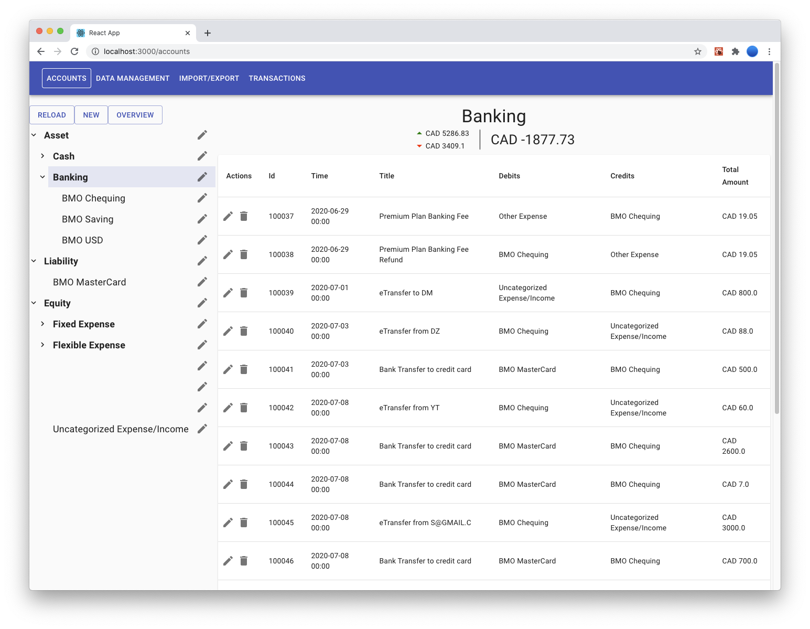
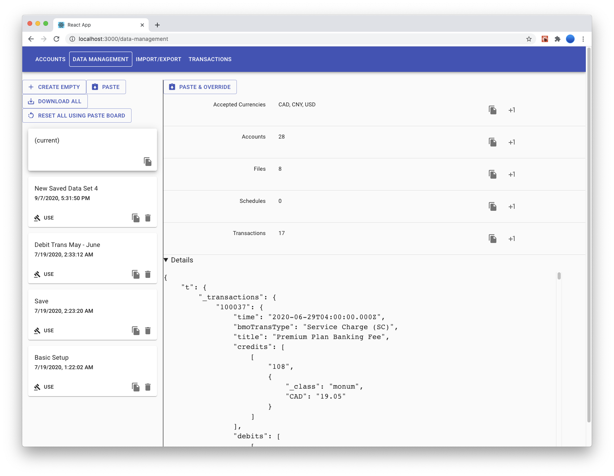
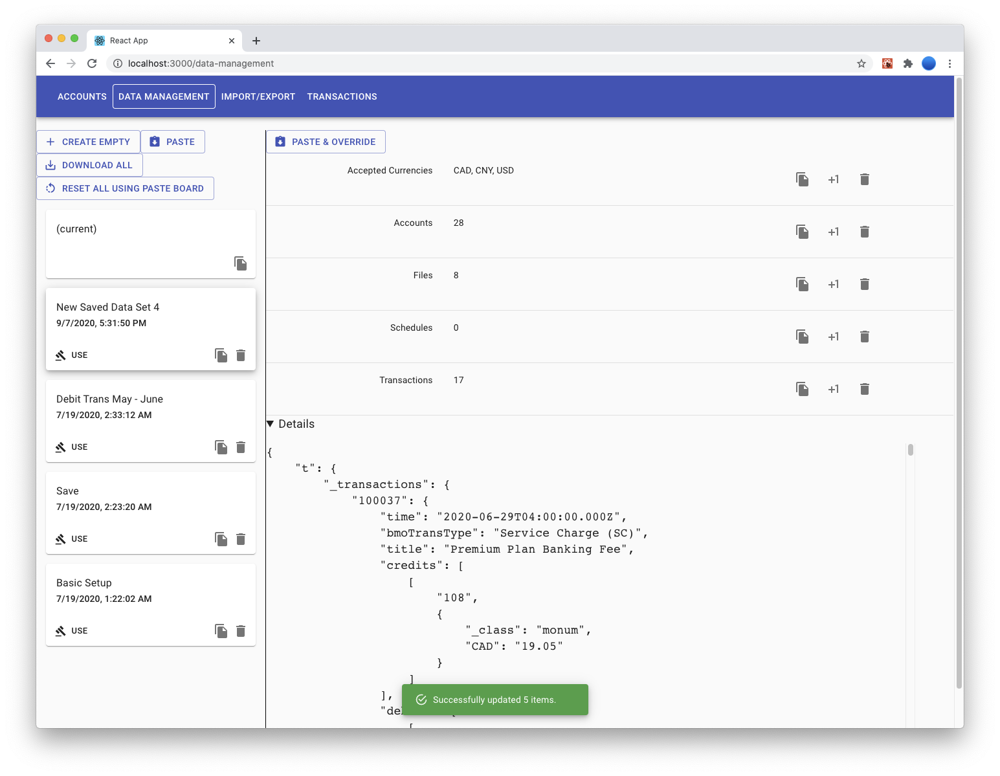
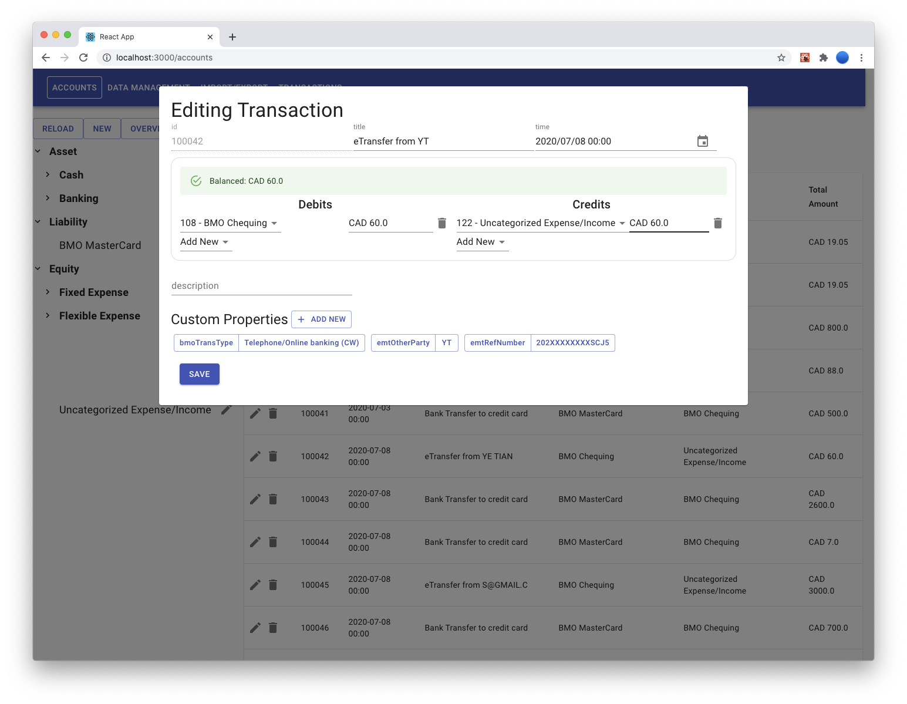
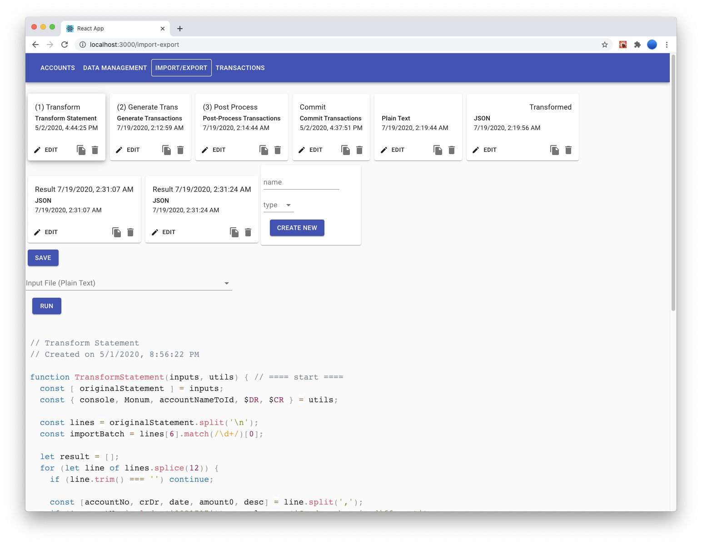

# Money Tracker

- Takes over [yifeiyin/MoneyTracker](https://github.com/yifeiyin/MoneyTracker)
- Integrates with [yifeiyin/MasterCard-Cache-Server](https://github.com/yifeiyin/MasterCard-Cache-Server)

## Features

- Multi-currency support
    - `0.1 CAD + 0.2 CAD === 0.3 CAD`
    - `42 USD + 10.01 CAD + 0.01 USD === 42.01 USD + 10.01 CAD`
- Merchant location, merchant type and other information are fetched using MaterCard API
- Supports import transactions from any machine-readable data source (eg. online banking systems)
- In-browser code editor enables 100% customization on data import/processing
- Mini file system to store code and data
- Use drag-and-drop instead of coding (planned, Blockly)

## Screenshots

### Account Management & View Transactions

### Data Management: Import/Export/Save/Load
<!--  -->

### Edit Transaction

### Code Editor & Simple File System for Customizing Imports

## Sample Data

`src/example.json` contains an data set with personal information removed.

## Other Links

- [React Router](https://reacttraining.com/react-router/web/api/BrowserRouter)
- [Material UI Home Page](https://material-ui.com)
- [Material Icons](https://material-ui.com/components/material-icons/)
- [Blocky](https://developers.google.com/blockly)
