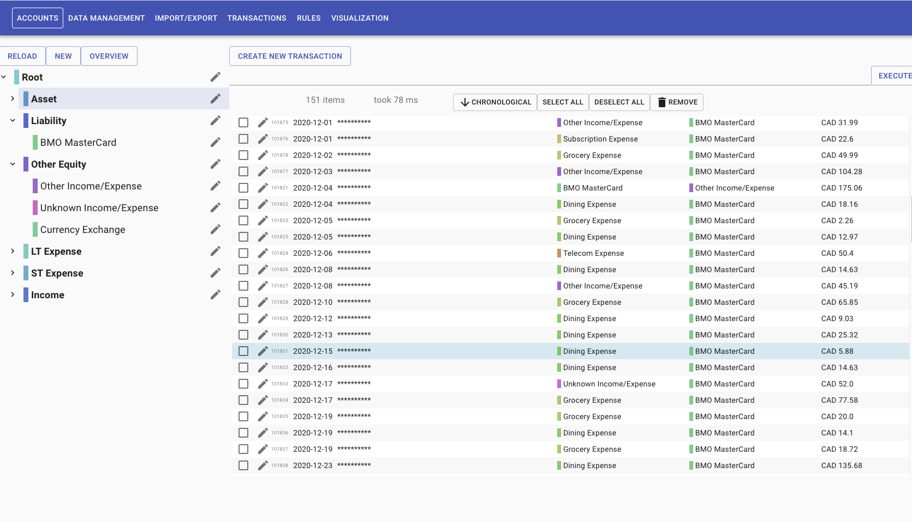
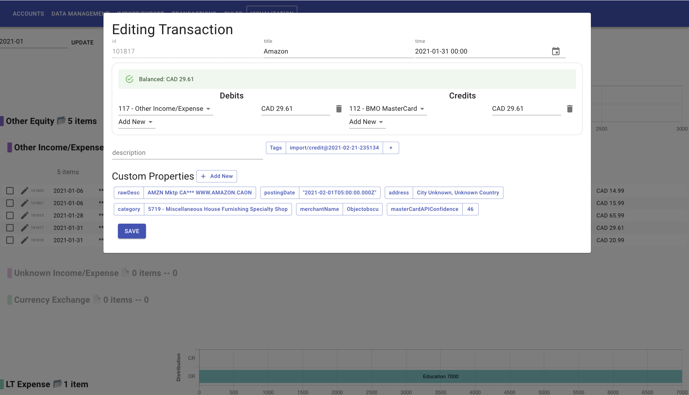
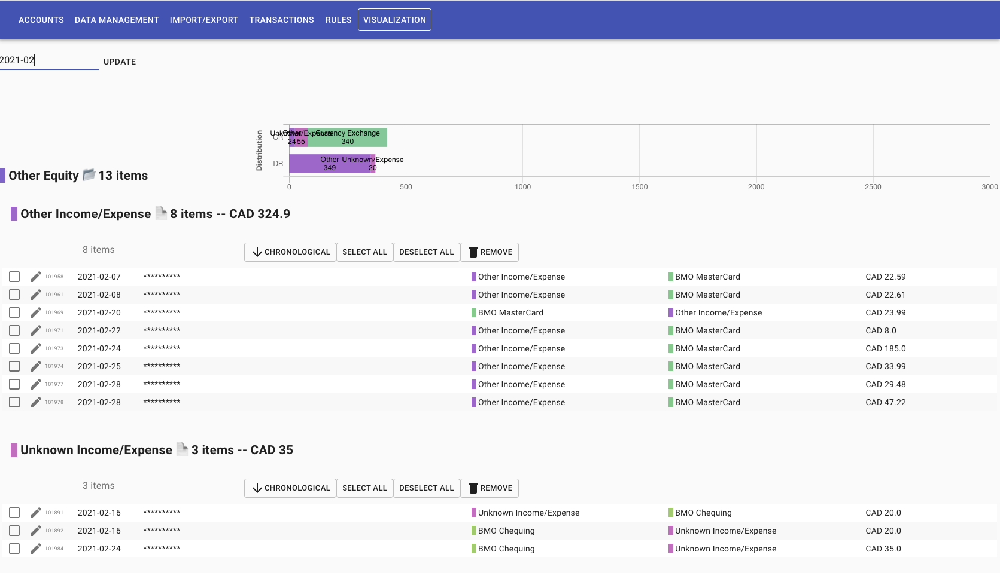

# Money Tracker

## Features

- 💵 Multi-currency support; no conversions
    - `0.1 CAD + 0.2 CAD === 0.3 CAD` ✅
    - `42 USD + 10.01 CAD + 0.01 USD === 42.01 USD + 10.01 CAD` ✅
- 💳 Supports import transactions from any machine-readable data source
    - Doesn't support yours? Write your own parser
- ⚙️ Create arbitrary rules to categorize transactions
- 📊 Visualize income and expense over arbitrary time frame

## Screenshots

  

## Similar Projects

#### Non-Open Source
- [Mint](https://mint.intuit.com)
- [Microsoft: Money in Excel](https://www.microsoft.com/en-us/microsoft-365/blog/2020/06/15/introducing-money-excel-easier-manage-finances/)

#### Open Source
- https://akaunting.com (PHP)
- [beancount/beancount: Beancount: Double-Entry Accounting from Text Files.](https://github.com/beancount/beancount) (Python)
- [kresusapp/kresus: Get rich, or die codin'](https://github.com/kresusapp/kresus) (TypeScript)
- [kevinschaich/mintable: 🍃 Automate your personal finances](https://github.com/kevinschaich/mintable)
- [moneymanagerex/moneymanagerex](https://github.com/moneymanagerex/moneymanagerex) (C++, wxWidgets)
- [manuel-uberti/boodle](https://github.com/manuel-uberti/boodle) (Clojure)
- [nymanjens/facto: Family Accounting Tool](https://github.com/nymanjens/facto) (Scala)
- [firefly-iii/firefly-iii: a personal finances manager](https://github.com/firefly-iii/firefly-iii) (Java)
- [paukiatwee/budgetapp](https://github.com/paukiatwee/budgetapp) (Java)

- [range-of-motion/budget](https://github.com/range-of-motion/budget)
- [austinkregel/finance](https://github.com/austinkregel/finance)

- [hsoft/moneyguru: Future-aware personal finance application](https://github.com/hsoft/moneyguru#unmaintained)
- [diegomacario/Poor-Fox: A beautiful command-line application designed to help you keep track of your expenses.](https://github.com/diegomacario/Poor-Fox)

